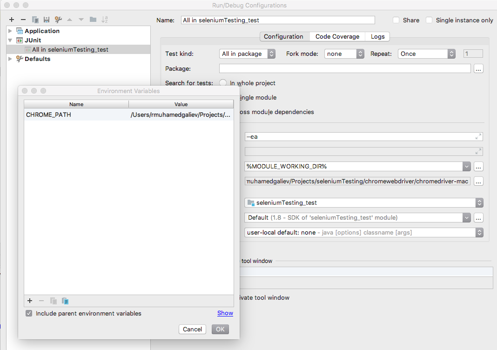

# seleniumTesting
Project for learning with selenium and etc

For run test please use environmant variable __CHROME_PATH__

As sample 

How to set environment variables please read [link](https://www.jetbrains.com/help/idea/run-debug-configuration-application.html)

If you want run test from command line please use foolow commands

> ./gradlew linux - for run in linux
> ./gradlew mac - for run in mac
> ./gradlew win - for run in windows
